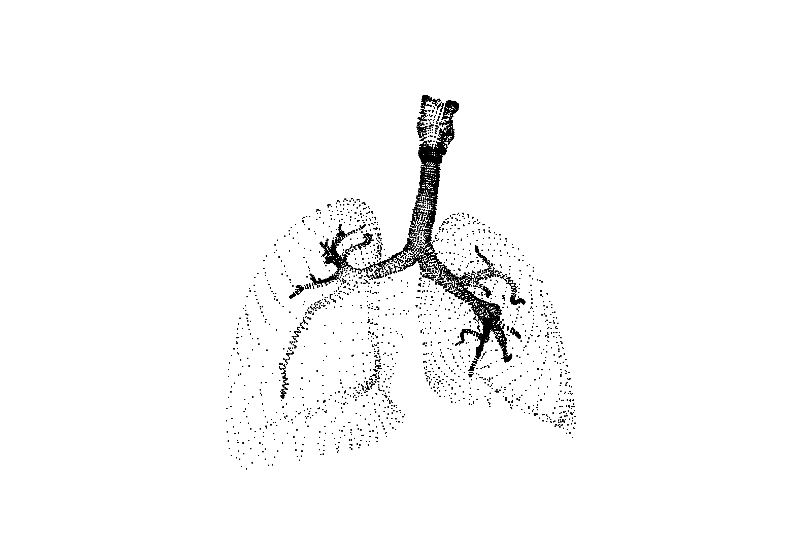
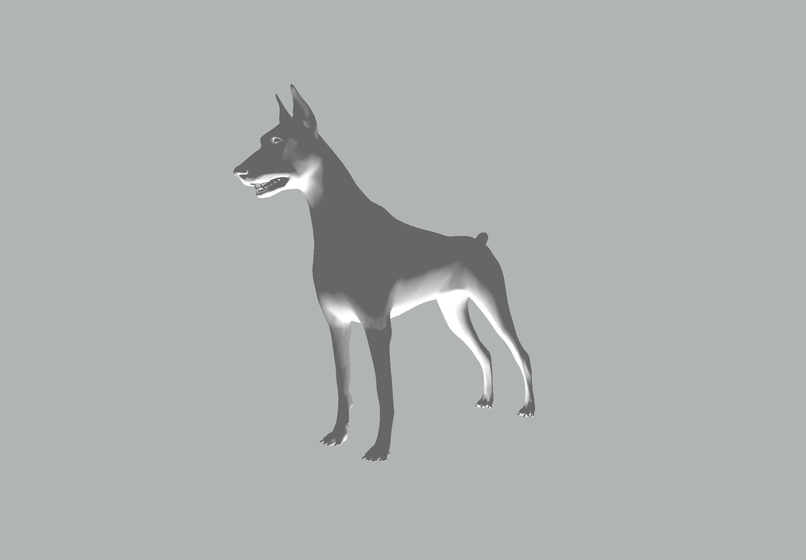
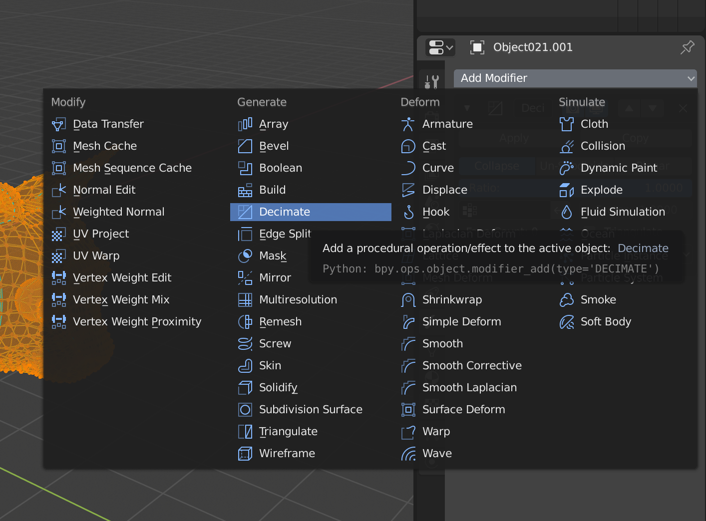
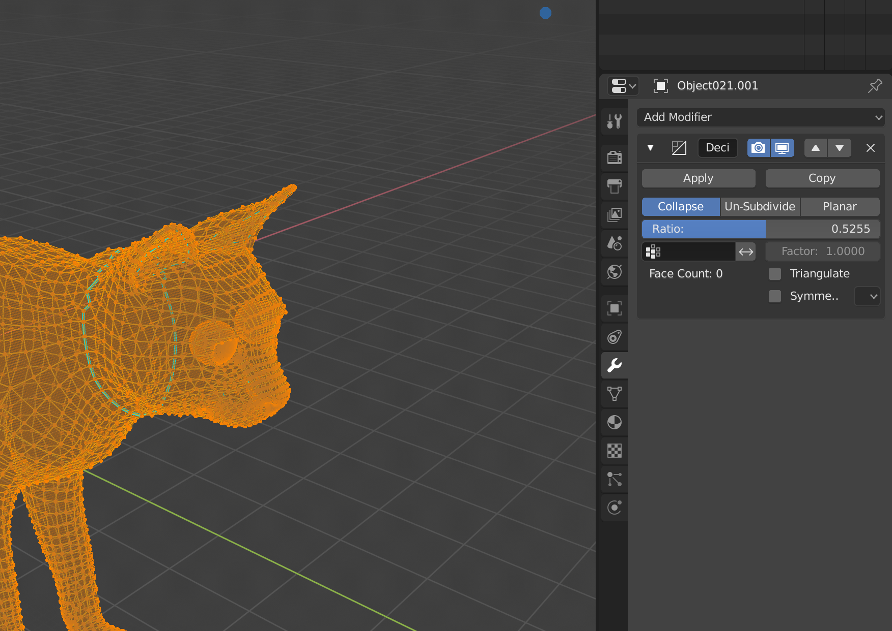

# Anivive 3D model examples

## About


 

This repository shows how you might load a GLTF/GLB 3D model and render it using three.js in the Anivive digital brand style. It contains two custom three classes, [AniviveParticleMesh](./src/objects/AniviveParticleMesh.js) and [AniviveStandardMesh](./src/objects/AniviveStandardMesh.js).

## Examples (particle)
* [Lungs](https://anivive-model-example.movingbrands.now.sh/?model=lungs&type=AniviveParticleMesh&background=FFFFFF)
* [Platelets](https://anivive-model-example.movingbrands.now.sh/?model=platelets&type=AniviveParticleMesh&background=FFFFFF)
* [Virus](https://anivive-model-example.movingbrands.now.sh/?model=virus&type=AniviveParticleMesh&background=FFFFFF)

## Examples (standard with lighting)
* [Dog](https://anivive-model-example.movingbrands.now.sh/?model=dog&type=AniviveStandardMesh)
* [Cat](https://anivive-model-example.movingbrands.now.sh/?model=cat&type=AniviveStandardMesh)

### Particle Mesh

```js
// import the module
import { AniviveParticleMesh } from './objects';

// load our GLTF binary
new GLTFLoader().load('./lungs.glb', result => {
  const lungParticles = new AniviveParticleMesh({
    gltfObject: result, // the object returned from the gltf loader
    size: 2 // size of particles
  })
  scene.add(lungParticles)
})
```

### Standard Mesh

```js
// import the module
import { AniviveStandardMesh } from './objects';

// load our GLTF binary
new GLTFLoader().load('./dog.glb', result => {
  const dog = new AniviveStandardMesh({
    gltfObject: result
  })
  scene.add(dog)
})
```

## 3D assets
This repository also includes assets in GLTF binary (.glb) format which have been formatted for use on the web.

### Included assets
* [Lungs (lungs.glb)](https://github.com/movingbrands/anivive-model-example/raw/prototype/assets/lungs.glb)
* [Platelets (platelets.glb)](https://github.com/movingbrands/anivive-model-example/raw/prototype/assets/platelets.glb)
* [Virus (virus.glb)](https://github.com/movingbrands/anivive-model-example/raw/prototype/assets/virus.glb)
* [Dog (dog.glb)](https://github.com/movingbrands/anivive-model-example/raw/prototype/assets/dog.glb)
* [Cat (cat.glb)](https://github.com/movingbrands/anivive-model-example/raw/prototype/assets/cat.glb)

### Creating new 3D assets (from OBJ)

#### Principles
* Aim to keep all 3d files below 500kb – the smaller the better. For the particle mesh, for example, this might means using 3d artwork with fewer than 10000 verts as a starting point.

#### Process
1. All normals and material properties aren't needed and can be stripped from the model.
2. You can use the Decimate operation in Blender to simplify the model's geometry and cut down its size. This will remove geometry whilst trying to retain the original form. The process will require trial and error testing the model 

	 
	

3. Convert to GLTF:
	* with command line using node.js and [obj2gltf](https://github.com/AnalyticalGraphicsInc/obj2gltf):
	
		```bash
		npm install -g obj2gltf
		obj2gltf -i /path/to/model.obj -o ./assets/model.glb
		```

	* Using [cesiumjs.org/convertModel](https://cesiumjs.org/convertModel/)

## Getting started

```bash
npm install
```

## Running locally (uses Parcel)

```bash
npm run dev
```

This command runs a local live reload server and typically hosts the site at [http://localhost:1234](http://localhost:1234).

## Build

```bash
npm run build
```

This command builds the JS and outputs a static app to the `/dist` directory.
